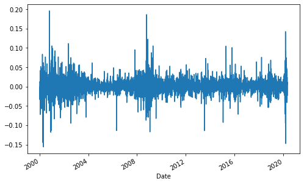

## Simpler Returns - Part I

Download the data for Microsoft (‘MSFT’) from Yahoo Finance for the period ‘2000-1-1’ until today.


```python
import numpy as np
import pandas as pd
from pandas_datareader import data as wb
import matplotlib.pyplot as plt
```

    C:\Users\aks13\anaconda3\lib\site-packages\pandas_datareader\compat\__init__.py:7: FutureWarning: pandas.util.testing is deprecated. Use the functions in the public API at pandas.testing instead.
      from pandas.util.testing import assert_frame_equal
    

Apply the .**head()** and **.tail()** methods to check if the data is ok. Always pay attention to the dates. Try to get an idea about how the stock price changed during the period.


```python
MSFT = wb.DataReader('MSFT', data_source='yahoo', start='2000-1-1')['Adj Close']
MSFT.tail()
```


    Date
    2020-05-06    182.539993
    2020-05-07    183.600006
    2020-05-08    184.679993
    2020-05-11    186.740005
    2020-05-12    182.509995
    Name: Adj Close, dtype: float64


```python
MSFT.head()
```


    Date
    1999-12-31    37.453701
    2000-01-03    37.393559
    2000-01-04    36.130390
    2000-01-05    36.511333
    2000-01-06    35.288280
    Name: Adj Close, dtype: float64


### Simple Rate of Return

Calculate the simple returns of ‘MSFT’ for the given timeframe.

$$
\frac{P_1 - P_0}{P_0} = \frac{P_1}{P_0} - 1
$$


```python
simple_return = (MSFT / MSFT.shift(1))-1
simple_return.plot(figsize=(8,5))
```


    <matplotlib.axes._subplots.AxesSubplot at 0x2190d78db08>





```python
avg_return_daily = simple_return.mean()
print(avg_return_daily)
```

    0.0004994750252224176
    


```python
avg_return_annual = simple_return.mean() * 250
avg_return_annual
```


    0.12486875630560439


```python
print("Simple Rate of Return for Microsoft :" , str(round(avg_return_annual*100,2)), '%')
```

    Simple Rate of Return for Microsoft : 12.49 %
    
