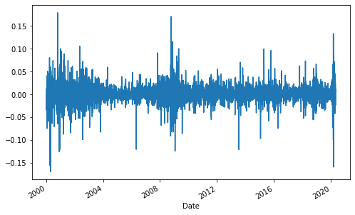

## Logarithmic Returns


```python
import numpy as np
from pandas_datareader import data as wb
import matplotlib.pyplot as plt
MSFT = wb.DataReader('MSFT', data_source='yahoo', start='2000-1-1')
MSFT
```

    C:\Users\aks13\anaconda3\lib\site-packages\pandas_datareader\compat\__init__.py:7: FutureWarning: pandas.util.testing is deprecated. Use the functions in the public API at pandas.testing instead.
      from pandas.util.testing import assert_frame_equal
    


<div>
<style scoped>
    .dataframe tbody tr th:only-of-type {
        vertical-align: middle;
    }

    .dataframe tbody tr th {
        vertical-align: top;
    }

    .dataframe thead th {
        text-align: right;
    }
</style>
<table border="1" class="dataframe">
  <thead>
    <tr style="text-align: right;">
      <th></th>
      <th>High</th>
      <th>Low</th>
      <th>Open</th>
      <th>Close</th>
      <th>Volume</th>
      <th>Adj Close</th>
    </tr>
    <tr>
      <th>Date</th>
      <th></th>
      <th></th>
      <th></th>
      <th></th>
      <th></th>
      <th></th>
    </tr>
  </thead>
  <tbody>
    <tr>
      <th>1999-12-31</th>
      <td>58.875000</td>
      <td>58.125000</td>
      <td>58.750000</td>
      <td>58.375000</td>
      <td>12517600.0</td>
      <td>37.453701</td>
    </tr>
    <tr>
      <th>2000-01-03</th>
      <td>59.312500</td>
      <td>56.000000</td>
      <td>58.687500</td>
      <td>58.281250</td>
      <td>53228400.0</td>
      <td>37.393559</td>
    </tr>
    <tr>
      <th>2000-01-04</th>
      <td>58.562500</td>
      <td>56.125000</td>
      <td>56.781250</td>
      <td>56.312500</td>
      <td>54119000.0</td>
      <td>36.130390</td>
    </tr>
    <tr>
      <th>2000-01-05</th>
      <td>58.187500</td>
      <td>54.687500</td>
      <td>55.562500</td>
      <td>56.906250</td>
      <td>64059600.0</td>
      <td>36.511333</td>
    </tr>
    <tr>
      <th>2000-01-06</th>
      <td>56.937500</td>
      <td>54.187500</td>
      <td>56.093750</td>
      <td>55.000000</td>
      <td>54976600.0</td>
      <td>35.288280</td>
    </tr>
    <tr>
      <th>...</th>
      <td>...</td>
      <td>...</td>
      <td>...</td>
      <td>...</td>
      <td>...</td>
      <td>...</td>
    </tr>
    <tr>
      <th>2020-05-06</th>
      <td>184.199997</td>
      <td>181.630005</td>
      <td>182.080002</td>
      <td>182.539993</td>
      <td>32139300.0</td>
      <td>182.539993</td>
    </tr>
    <tr>
      <th>2020-05-07</th>
      <td>184.550003</td>
      <td>182.580002</td>
      <td>184.169998</td>
      <td>183.600006</td>
      <td>28316000.0</td>
      <td>183.600006</td>
    </tr>
    <tr>
      <th>2020-05-08</th>
      <td>185.000000</td>
      <td>183.360001</td>
      <td>184.979996</td>
      <td>184.679993</td>
      <td>30912600.0</td>
      <td>184.679993</td>
    </tr>
    <tr>
      <th>2020-05-11</th>
      <td>187.509995</td>
      <td>182.850006</td>
      <td>183.149994</td>
      <td>186.740005</td>
      <td>30892700.0</td>
      <td>186.740005</td>
    </tr>
    <tr>
      <th>2020-05-12</th>
      <td>187.039993</td>
      <td>182.300003</td>
      <td>186.800003</td>
      <td>182.509995</td>
      <td>31952900.0</td>
      <td>182.509995</td>
    </tr>
  </tbody>
</table>
<p>5123 rows × 6 columns</p>
</div>


### Log Returns

$$
ln(\frac{P_t}{P_{t-1}})
$$

Calculate the Log returns for Microsoft.


```python
returns = np.log(MSFT['Adj Close'] / MSFT['Adj Close'].shift(1))
returns
```


    Date
    1999-12-31         NaN
    2000-01-03   -0.001607
    2000-01-04   -0.034364
    2000-01-05    0.010488
    2000-01-06   -0.034072
                    ...   
    2020-05-06    0.009799
    2020-05-07    0.005790
    2020-05-08    0.005865
    2020-05-11    0.011093
    2020-05-12   -0.022912
    Name: Adj Close, Length: 5123, dtype: float64


Plot the results on a graph.


```python
returns.plot(figsize=(8,5))
```


    <matplotlib.axes._subplots.AxesSubplot at 0x244dedf0e88>





Estimate the daily and the annual mean of the obtained log returns.


```python
returns_daily = returns.mean()
returns_daily
```


    0.00030919551059129213


```python
returns_annual = returns.mean() * 250
returns_annual
```


    0.07729887764782303


Print the result in a presentable form.


```python
print('The Logarithmic rate of Return for MSFT :',str(round(returns_annual*100,2)),'%')
```

    The Logarithmic rate of Return for MSFT : 7.73 %
    

****

Repeat this exercise for any stock of interest to you. :)
