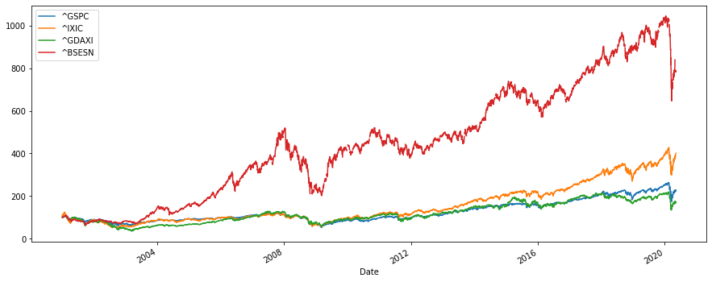
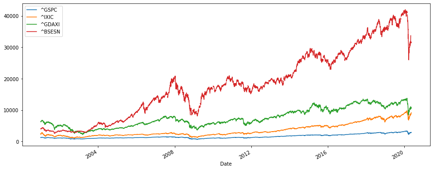

```python
import numpy as np
import pandas as pd
from pandas_datareader import data as wb
import matplotlib.pyplot as plt
```

    C:\Users\aks13\anaconda3\lib\site-packages\pandas_datareader\compat\__init__.py:7: FutureWarning: pandas.util.testing is deprecated. Use the functions in the public API at pandas.testing instead.
      from pandas.util.testing import assert_frame_equal
    


```python
tickers = ['^GSPC','^IXIC','^GDAXI','^BSESN']
data  = pd.DataFrame()
for t in tickers:
    data[t] = wb.DataReader(t, data_source='yahoo', start='2001-1-1')['Adj Close']
```


```python
data.head()
```


<div>
<style scoped>
    .dataframe tbody tr th:only-of-type {
        vertical-align: middle;
    }

    .dataframe tbody tr th {
        vertical-align: top;
    }

    .dataframe thead th {
        text-align: right;
    }
</style>
<table border="1" class="dataframe">
  <thead>
    <tr style="text-align: right;">
      <th></th>
      <th>^GSPC</th>
      <th>^IXIC</th>
      <th>^GDAXI</th>
      <th>^BSESN</th>
    </tr>
    <tr>
      <th>Date</th>
      <th></th>
      <th></th>
      <th></th>
      <th></th>
    </tr>
  </thead>
  <tbody>
    <tr>
      <th>2001-01-02</th>
      <td>1283.270020</td>
      <td>2291.860107</td>
      <td>6289.819824</td>
      <td>4018.879883</td>
    </tr>
    <tr>
      <th>2001-01-03</th>
      <td>1347.560059</td>
      <td>2616.689941</td>
      <td>6434.959961</td>
      <td>4060.020020</td>
    </tr>
    <tr>
      <th>2001-01-04</th>
      <td>1333.339966</td>
      <td>2566.830078</td>
      <td>6376.540039</td>
      <td>4115.370117</td>
    </tr>
    <tr>
      <th>2001-01-05</th>
      <td>1298.349976</td>
      <td>2407.649902</td>
      <td>6382.310059</td>
      <td>4183.729980</td>
    </tr>
    <tr>
      <th>2001-01-08</th>
      <td>1295.859985</td>
      <td>2395.919922</td>
      <td>6392.169922</td>
      <td>4120.430176</td>
    </tr>
  </tbody>
</table>
</div>


```python
data.tail()
```


<div>
<style scoped>
    .dataframe tbody tr th:only-of-type {
        vertical-align: middle;
    }

    .dataframe tbody tr th {
        vertical-align: top;
    }

    .dataframe thead th {
        text-align: right;
    }
</style>
<table border="1" class="dataframe">
  <thead>
    <tr style="text-align: right;">
      <th></th>
      <th>^GSPC</th>
      <th>^IXIC</th>
      <th>^GDAXI</th>
      <th>^BSESN</th>
    </tr>
    <tr>
      <th>Date</th>
      <th></th>
      <th></th>
      <th></th>
      <th></th>
    </tr>
  </thead>
  <tbody>
    <tr>
      <th>2020-05-05</th>
      <td>2868.439941</td>
      <td>8809.120117</td>
      <td>10729.459961</td>
      <td>31453.509766</td>
    </tr>
    <tr>
      <th>2020-05-06</th>
      <td>2848.419922</td>
      <td>8854.389648</td>
      <td>10606.200195</td>
      <td>31685.750000</td>
    </tr>
    <tr>
      <th>2020-05-07</th>
      <td>2881.189941</td>
      <td>8979.660156</td>
      <td>10759.269531</td>
      <td>31443.380859</td>
    </tr>
    <tr>
      <th>2020-05-08</th>
      <td>2929.800049</td>
      <td>9121.320312</td>
      <td>10904.480469</td>
      <td>31642.699219</td>
    </tr>
    <tr>
      <th>2020-05-11</th>
      <td>2930.189941</td>
      <td>9192.339844</td>
      <td>10824.990234</td>
      <td>31561.220703</td>
    </tr>
  </tbody>
</table>
</div>


```python
data.info()
```

    <class 'pandas.core.frame.DataFrame'>
    DatetimeIndex: 4869 entries, 2001-01-02 to 2020-05-11
    Data columns (total 4 columns):
     #   Column  Non-Null Count  Dtype  
    ---  ------  --------------  -----  
     0   ^GSPC   4869 non-null   float64
     1   ^IXIC   4869 non-null   float64
     2   ^GDAXI  4783 non-null   float64
     3   ^BSESN  4629 non-null   float64
    dtypes: float64(4)
    memory usage: 190.2 KB
    


```python
data.iloc[0]
```


    ^GSPC     1283.270020
    ^IXIC     2291.860107
    ^GDAXI    6289.819824
    ^BSESN    4018.879883
    Name: 2001-01-02 00:00:00, dtype: float64


```python
(data / data.iloc[0] * 100).plot(figsize =(15,6))
```


    <matplotlib.axes._subplots.AxesSubplot at 0x220ee1d0d48>





```python
data.plot(figsize=(15,6))
```


    <matplotlib.axes._subplots.AxesSubplot at 0x220ee2a36c8>





```python
returns = (data/data.shift(1))-1
returns.tail()
```


<div>
<style scoped>
    .dataframe tbody tr th:only-of-type {
        vertical-align: middle;
    }

    .dataframe tbody tr th {
        vertical-align: top;
    }

    .dataframe thead th {
        text-align: right;
    }
</style>
<table border="1" class="dataframe">
  <thead>
    <tr style="text-align: right;">
      <th></th>
      <th>^GSPC</th>
      <th>^IXIC</th>
      <th>^GDAXI</th>
      <th>^BSESN</th>
    </tr>
    <tr>
      <th>Date</th>
      <th></th>
      <th></th>
      <th></th>
      <th></th>
    </tr>
  </thead>
  <tbody>
    <tr>
      <th>2020-05-05</th>
      <td>0.009041</td>
      <td>0.011298</td>
      <td>0.025095</td>
      <td>-0.008256</td>
    </tr>
    <tr>
      <th>2020-05-06</th>
      <td>-0.006979</td>
      <td>0.005139</td>
      <td>-0.011488</td>
      <td>0.007384</td>
    </tr>
    <tr>
      <th>2020-05-07</th>
      <td>0.011505</td>
      <td>0.014148</td>
      <td>0.014432</td>
      <td>-0.007649</td>
    </tr>
    <tr>
      <th>2020-05-08</th>
      <td>0.016872</td>
      <td>0.015776</td>
      <td>0.013496</td>
      <td>0.006339</td>
    </tr>
    <tr>
      <th>2020-05-11</th>
      <td>0.000133</td>
      <td>0.007786</td>
      <td>-0.007290</td>
      <td>-0.002575</td>
    </tr>
  </tbody>
</table>
</div>


```python
annual_returns = returns.mean()*250
print(annual_returns)
```

    ^GSPC     0.061847
    ^IXIC     0.098992
    ^GDAXI    0.044607
    ^BSESN    0.113791
    dtype: float64
    
