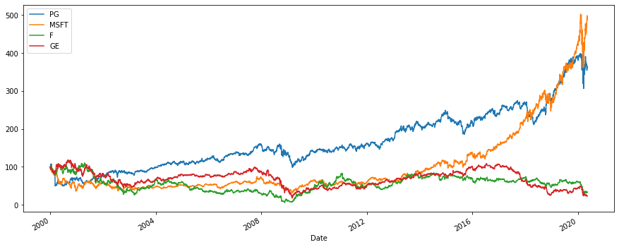
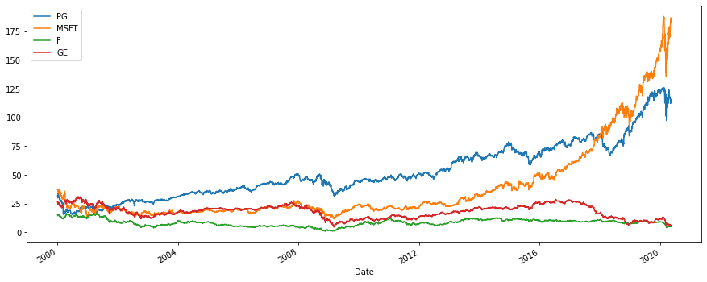

## Calculating the Return of a Portfolio of Securities

Download data for a portfolio composed of 5 stocks. Do it for Procter & Gamble Co, Microsoft, Ford, and General Electric Company for the period ‘2000-1-1’ until today.


```python
import numpy as np
import pandas as pd
from pandas_datareader import data as wb
import matplotlib.pyplot as plt
tickers = ['PG','MSFT','F','GE']
data  = pd.DataFrame()
for t in tickers:
    data[t] = wb.DataReader(t, data_source='yahoo', start='2000-1-1')['Adj Close']
```

### Normalization to 100:

$$
\frac {P_t}{P_0} * 100
$$

Normalize to a hundred and plot the data on a graph (you can apply the .loc() or the .iloc() method). 


```python
(data / data.iloc[0] * 100).plot(figsize =(15,6))
# This is the Normalized Graph
```


    <matplotlib.axes._subplots.AxesSubplot at 0x2883ca2a248>





```python
data.plot(figsize=(15,6))
#This is the graph without normalization
```


    <matplotlib.axes._subplots.AxesSubplot at 0x2883c6a1888>





How would you interpret the behavior of the stocks? Just by looking at the chart, would you be able to create a portfolio that provides a solid return on investment?

*****

### Calculating the Return of a Portfolio of Securities

Obtain the simple return of the securities in the portfolio and store the results in a new table.


```python
returns = (data/data.shift(1))-1
returns.head()
```


<div>
<style scoped>
    .dataframe tbody tr th:only-of-type {
        vertical-align: middle;
    }

    .dataframe tbody tr th {
        vertical-align: top;
    }

    .dataframe thead th {
        text-align: right;
    }
</style>
<table border="1" class="dataframe">
  <thead>
    <tr style="text-align: right;">
      <th></th>
      <th>PG</th>
      <th>MSFT</th>
      <th>F</th>
      <th>GE</th>
    </tr>
    <tr>
      <th>Date</th>
      <th></th>
      <th></th>
      <th></th>
      <th></th>
    </tr>
  </thead>
  <tbody>
    <tr>
      <th>1999-12-31</th>
      <td>NaN</td>
      <td>NaN</td>
      <td>NaN</td>
      <td>NaN</td>
    </tr>
    <tr>
      <th>2000-01-03</th>
      <td>-0.021677</td>
      <td>-0.001606</td>
      <td>-0.017585</td>
      <td>-0.030695</td>
    </tr>
    <tr>
      <th>2000-01-04</th>
      <td>-0.019241</td>
      <td>-0.033780</td>
      <td>-0.033413</td>
      <td>-0.039999</td>
    </tr>
    <tr>
      <th>2000-01-05</th>
      <td>-0.019025</td>
      <td>0.010544</td>
      <td>0.003704</td>
      <td>-0.001737</td>
    </tr>
    <tr>
      <th>2000-01-06</th>
      <td>0.046060</td>
      <td>-0.033498</td>
      <td>0.001229</td>
      <td>0.013369</td>
    </tr>
  </tbody>
</table>
</div>


First, assume you would like to create an equally-weighted portfolio. Create the array, naming it “weights”.


```python
weights = np.array([0.25,0.25,0.25,0.25])
weights
```


    array([0.25, 0.25, 0.25, 0.25])


Obtain the annual returns of each of the stocks and then calculate the dot product of these returns and the weights.


```python
annual_returns = returns.mean()*250
print(annual_returns)
```

    PG      0.086598
    MSFT    0.124869
    F       0.033336
    GE     -0.018598
    dtype: float64
    


```python
np.dot(annual_returns, weights)
```


    0.05655110118812049


Transform the result into a percentage form. 


```python
portfolio_return = round(np.dot(annual_returns, weights)*100,2)
print("The Return ofthis Portfolio of Securities is :",portfolio_return,'%')
```

    The Return ofthis Portfolio of Securities is : 5.66 %
    

Is the return of this portfolio satisfactory?
