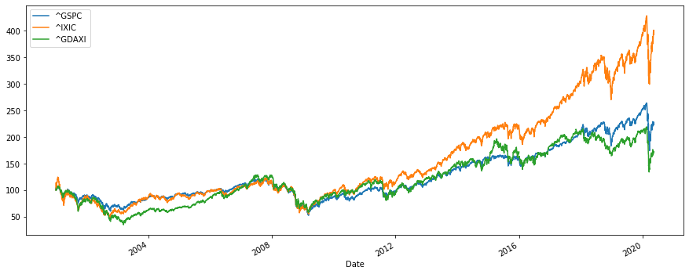

## Calculating the Return of Indices

Consider three famous indices – Search Results Finance results DAX PERFORMANCE-INDEX, S&P 500, and the Nasdaq for the period of 1st of January 2000 until today.


```python
import numpy as np
import pandas as pd
from pandas_datareader import data as wb
import matplotlib.pyplot as plt
tickers = ['^GSPC','^IXIC','^GDAXI']
data  = pd.DataFrame()
for t in tickers:
    data[t] = wb.DataReader(t, data_source='yahoo', start='2001-1-1')['Adj Close']
data.head()
```


<div>
<style scoped>
    .dataframe tbody tr th:only-of-type {
        vertical-align: middle;
    }

    .dataframe tbody tr th {
        vertical-align: top;
    }

    .dataframe thead th {
        text-align: right;
    }
</style>
<table border="1" class="dataframe">
  <thead>
    <tr style="text-align: right;">
      <th></th>
      <th>^GSPC</th>
      <th>^IXIC</th>
      <th>^GDAXI</th>
    </tr>
    <tr>
      <th>Date</th>
      <th></th>
      <th></th>
      <th></th>
    </tr>
  </thead>
  <tbody>
    <tr>
      <th>2001-01-02</th>
      <td>1283.270020</td>
      <td>2291.860107</td>
      <td>6289.819824</td>
    </tr>
    <tr>
      <th>2001-01-03</th>
      <td>1347.560059</td>
      <td>2616.689941</td>
      <td>6434.959961</td>
    </tr>
    <tr>
      <th>2001-01-04</th>
      <td>1333.339966</td>
      <td>2566.830078</td>
      <td>6376.540039</td>
    </tr>
    <tr>
      <th>2001-01-05</th>
      <td>1298.349976</td>
      <td>2407.649902</td>
      <td>6382.310059</td>
    </tr>
    <tr>
      <th>2001-01-08</th>
      <td>1295.859985</td>
      <td>2395.919922</td>
      <td>6392.169922</td>
    </tr>
  </tbody>
</table>
</div>


Normalize the data to 100 and plot the results on a graph. 


```python
(data / data.iloc[0] * 100).plot(figsize =(15,6))
```


    <matplotlib.axes._subplots.AxesSubplot at 0x197a813f108>





How would you explain the common and the different parts of the behavior of the three indices?

*****

Obtain the simple returns of the indices.


```python
returns = (data/data.shift(1))-1
returns.tail()
```


<div>
<style scoped>
    .dataframe tbody tr th:only-of-type {
        vertical-align: middle;
    }

    .dataframe tbody tr th {
        vertical-align: top;
    }

    .dataframe thead th {
        text-align: right;
    }
</style>
<table border="1" class="dataframe">
  <thead>
    <tr style="text-align: right;">
      <th></th>
      <th>^GSPC</th>
      <th>^IXIC</th>
      <th>^GDAXI</th>
    </tr>
    <tr>
      <th>Date</th>
      <th></th>
      <th></th>
      <th></th>
    </tr>
  </thead>
  <tbody>
    <tr>
      <th>2020-05-06</th>
      <td>-0.006979</td>
      <td>0.005139</td>
      <td>-0.011488</td>
    </tr>
    <tr>
      <th>2020-05-07</th>
      <td>0.011505</td>
      <td>0.014148</td>
      <td>0.014432</td>
    </tr>
    <tr>
      <th>2020-05-08</th>
      <td>0.016872</td>
      <td>0.015776</td>
      <td>0.013496</td>
    </tr>
    <tr>
      <th>2020-05-11</th>
      <td>0.000133</td>
      <td>0.007786</td>
      <td>-0.007290</td>
    </tr>
    <tr>
      <th>2020-05-12</th>
      <td>-0.020500</td>
      <td>-0.020646</td>
      <td>NaN</td>
    </tr>
  </tbody>
</table>
</div>


Estimate the average annual return of each index.


```python
annual_returns = returns.mean()*250
print(annual_returns)
```

    ^GSPC     0.060782
    ^IXIC     0.097912
    ^GDAXI    0.044607
    dtype: float64
    
