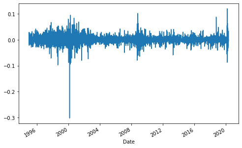

```python
import numpy as np
from pandas_datareader import data as wb
import matplotlib.pyplot as plt
```


```python
PG = wb.DataReader('PG', data_source='yahoo', start='1995-1-1')
```


```python
PG.head()
```


<div>
<style scoped>
    .dataframe tbody tr th:only-of-type {
        vertical-align: middle;
    }

    .dataframe tbody tr th {
        vertical-align: top;
    }

    .dataframe thead th {
        text-align: right;
    }
</style>
<table border="1" class="dataframe">
  <thead>
    <tr style="text-align: right;">
      <th></th>
      <th>High</th>
      <th>Low</th>
      <th>Open</th>
      <th>Close</th>
      <th>Volume</th>
      <th>Adj Close</th>
    </tr>
    <tr>
      <th>Date</th>
      <th></th>
      <th></th>
      <th></th>
      <th></th>
      <th></th>
      <th></th>
    </tr>
  </thead>
  <tbody>
    <tr>
      <th>1995-01-03</th>
      <td>15.62500</td>
      <td>15.43750</td>
      <td>15.46875</td>
      <td>15.59375</td>
      <td>3318400.0</td>
      <td>6.320252</td>
    </tr>
    <tr>
      <th>1995-01-04</th>
      <td>15.65625</td>
      <td>15.31250</td>
      <td>15.53125</td>
      <td>15.46875</td>
      <td>2218800.0</td>
      <td>6.269589</td>
    </tr>
    <tr>
      <th>1995-01-05</th>
      <td>15.43750</td>
      <td>15.21875</td>
      <td>15.37500</td>
      <td>15.25000</td>
      <td>2319600.0</td>
      <td>6.180927</td>
    </tr>
    <tr>
      <th>1995-01-06</th>
      <td>15.40625</td>
      <td>15.15625</td>
      <td>15.15625</td>
      <td>15.28125</td>
      <td>3438000.0</td>
      <td>6.193593</td>
    </tr>
    <tr>
      <th>1995-01-09</th>
      <td>15.40625</td>
      <td>15.18750</td>
      <td>15.34375</td>
      <td>15.21875</td>
      <td>1795200.0</td>
      <td>6.168259</td>
    </tr>
  </tbody>
</table>
</div>


```python
PG.tail()
```


<div>
<style scoped>
    .dataframe tbody tr th:only-of-type {
        vertical-align: middle;
    }

    .dataframe tbody tr th {
        vertical-align: top;
    }

    .dataframe thead th {
        text-align: right;
    }
</style>
<table border="1" class="dataframe">
  <thead>
    <tr style="text-align: right;">
      <th></th>
      <th>High</th>
      <th>Low</th>
      <th>Open</th>
      <th>Close</th>
      <th>Volume</th>
      <th>Adj Close</th>
    </tr>
    <tr>
      <th>Date</th>
      <th></th>
      <th></th>
      <th></th>
      <th></th>
      <th></th>
      <th></th>
    </tr>
  </thead>
  <tbody>
    <tr>
      <th>2020-05-05</th>
      <td>117.260002</td>
      <td>115.209999</td>
      <td>115.800003</td>
      <td>116.010002</td>
      <td>5425200.0</td>
      <td>116.010002</td>
    </tr>
    <tr>
      <th>2020-05-06</th>
      <td>116.139999</td>
      <td>112.889999</td>
      <td>115.540001</td>
      <td>113.099998</td>
      <td>7892200.0</td>
      <td>113.099998</td>
    </tr>
    <tr>
      <th>2020-05-07</th>
      <td>114.139999</td>
      <td>111.820000</td>
      <td>114.059998</td>
      <td>112.169998</td>
      <td>8762800.0</td>
      <td>112.169998</td>
    </tr>
    <tr>
      <th>2020-05-08</th>
      <td>116.300003</td>
      <td>113.389999</td>
      <td>113.519997</td>
      <td>115.949997</td>
      <td>9283100.0</td>
      <td>115.949997</td>
    </tr>
    <tr>
      <th>2020-05-11</th>
      <td>116.010002</td>
      <td>114.919998</td>
      <td>115.750000</td>
      <td>115.309998</td>
      <td>6946300.0</td>
      <td>115.309998</td>
    </tr>
  </tbody>
</table>
</div>


```python
PG.info()
```

    <class 'pandas.core.frame.DataFrame'>
    DatetimeIndex: 6384 entries, 1995-01-03 to 2020-05-11
    Data columns (total 6 columns):
     #   Column     Non-Null Count  Dtype  
    ---  ------     --------------  -----  
     0   High       6384 non-null   float64
     1   Low        6384 non-null   float64
     2   Open       6384 non-null   float64
     3   Close      6384 non-null   float64
     4   Volume     6384 non-null   float64
     5   Adj Close  6384 non-null   float64
    dtypes: float64(6)
    memory usage: 349.1 KB
    


```python
PG['simple_return'] = (PG['Adj Close'] / PG['Adj Close'].shift(1)) -1
```


```python
print(PG['simple_return'])
```

    Date
    1995-01-03         NaN
    1995-01-04   -0.008016
    1995-01-05   -0.014142
    1995-01-06    0.002049
    1995-01-09   -0.004090
                    ...   
    2020-05-05    0.002073
    2020-05-06   -0.025084
    2020-05-07   -0.008223
    2020-05-08    0.033699
    2020-05-11   -0.005520
    Name: simple_return, Length: 6384, dtype: float64
    


```python
PG['simple_return'].plot(figsize=(8,5))
```


    <matplotlib.axes._subplots.AxesSubplot at 0x1ceea23a508>





```python
avg_return_daily = PG['simple_return'].mean()
print(avg_return_daily)
```

    0.0005589302832988329
    


```python
avg_return_annual = PG['simple_return'].mean()*250
avg_return_annual
```


    0.13973257082470822


```python
print(str(round(avg_return_annual*100, 2)) + ' %')
```

    13.97 %
    
