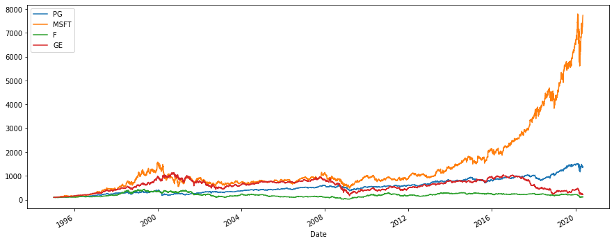
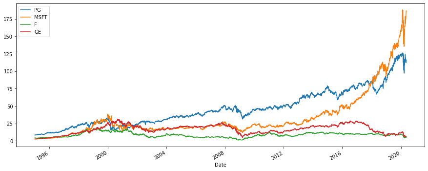

```python
import numpy as np
import pandas as pd
from pandas_datareader import data as wb
import matplotlib.pyplot as plt
```

    C:\Users\aks13\anaconda3\lib\site-packages\pandas_datareader\compat\__init__.py:7: FutureWarning: pandas.util.testing is deprecated. Use the functions in the public API at pandas.testing instead.
      from pandas.util.testing import assert_frame_equal
    


```python
tickers = ['PG','MSFT','F','GE']
data  = pd.DataFrame()
for t in tickers:
    data[t] = wb.DataReader(t, data_source='yahoo', start='1995-1-1')['Adj Close']
```


```python
data.head()
```


<div>
<style scoped>
    .dataframe tbody tr th:only-of-type {
        vertical-align: middle;
    }

    .dataframe tbody tr th {
        vertical-align: top;
    }

    .dataframe thead th {
        text-align: right;
    }
</style>
<table border="1" class="dataframe">
  <thead>
    <tr style="text-align: right;">
      <th></th>
      <th>PG</th>
      <th>MSFT</th>
      <th>F</th>
      <th>GE</th>
    </tr>
    <tr>
      <th>Date</th>
      <th></th>
      <th></th>
      <th></th>
      <th></th>
    </tr>
  </thead>
  <tbody>
    <tr>
      <th>1995-01-03</th>
      <td>8.313478</td>
      <td>2.413537</td>
      <td>4.186858</td>
      <td>2.729230</td>
    </tr>
    <tr>
      <th>1995-01-04</th>
      <td>8.246841</td>
      <td>2.431082</td>
      <td>4.299507</td>
      <td>2.729230</td>
    </tr>
    <tr>
      <th>1995-01-05</th>
      <td>8.130219</td>
      <td>2.390982</td>
      <td>4.261956</td>
      <td>2.735919</td>
    </tr>
    <tr>
      <th>1995-01-06</th>
      <td>8.146880</td>
      <td>2.431082</td>
      <td>4.261956</td>
      <td>2.722540</td>
    </tr>
    <tr>
      <th>1995-01-09</th>
      <td>8.113561</td>
      <td>2.416045</td>
      <td>4.337057</td>
      <td>2.695783</td>
    </tr>
  </tbody>
</table>
</div>


```python
data.tail()
```


<div>
<style scoped>
    .dataframe tbody tr th:only-of-type {
        vertical-align: middle;
    }

    .dataframe tbody tr th {
        vertical-align: top;
    }

    .dataframe thead th {
        text-align: right;
    }
</style>
<table border="1" class="dataframe">
  <thead>
    <tr style="text-align: right;">
      <th></th>
      <th>PG</th>
      <th>MSFT</th>
      <th>F</th>
      <th>GE</th>
    </tr>
    <tr>
      <th>Date</th>
      <th></th>
      <th></th>
      <th></th>
      <th></th>
    </tr>
  </thead>
  <tbody>
    <tr>
      <th>2020-05-05</th>
      <td>116.010002</td>
      <td>180.759995</td>
      <td>4.97</td>
      <td>6.20</td>
    </tr>
    <tr>
      <th>2020-05-06</th>
      <td>113.099998</td>
      <td>182.539993</td>
      <td>4.87</td>
      <td>5.98</td>
    </tr>
    <tr>
      <th>2020-05-07</th>
      <td>112.169998</td>
      <td>183.600006</td>
      <td>4.87</td>
      <td>6.11</td>
    </tr>
    <tr>
      <th>2020-05-08</th>
      <td>115.949997</td>
      <td>184.679993</td>
      <td>5.24</td>
      <td>6.29</td>
    </tr>
    <tr>
      <th>2020-05-11</th>
      <td>115.309998</td>
      <td>186.740005</td>
      <td>5.12</td>
      <td>6.19</td>
    </tr>
  </tbody>
</table>
</div>


```python
data.info()
```

    <class 'pandas.core.frame.DataFrame'>
    DatetimeIndex: 6384 entries, 1995-01-03 to 2020-05-11
    Data columns (total 4 columns):
     #   Column  Non-Null Count  Dtype  
    ---  ------  --------------  -----  
     0   PG      6384 non-null   float64
     1   MSFT    6384 non-null   float64
     2   F       6384 non-null   float64
     3   GE      6384 non-null   float64
    dtypes: float64(4)
    memory usage: 249.4 KB
    


```python
data.iloc[0]
```


    PG      8.313478
    MSFT    2.413537
    F       4.186858
    GE      2.729230
    Name: 1995-01-03 00:00:00, dtype: float64


```python
(data / data.iloc[0] * 100).plot(figsize =(15,6))
```


    <matplotlib.axes._subplots.AxesSubplot at 0x1a0eea132c8>





```python
data.plot(figsize=(15,6))
```


    <matplotlib.axes._subplots.AxesSubplot at 0x1a0ee529b48>





```python
returns = (data/data.shift(1))-1
returns.head()
```


<div>
<style scoped>
    .dataframe tbody tr th:only-of-type {
        vertical-align: middle;
    }

    .dataframe tbody tr th {
        vertical-align: top;
    }

    .dataframe thead th {
        text-align: right;
    }
</style>
<table border="1" class="dataframe">
  <thead>
    <tr style="text-align: right;">
      <th></th>
      <th>PG</th>
      <th>MSFT</th>
      <th>F</th>
      <th>GE</th>
    </tr>
    <tr>
      <th>Date</th>
      <th></th>
      <th></th>
      <th></th>
      <th></th>
    </tr>
  </thead>
  <tbody>
    <tr>
      <th>1995-01-03</th>
      <td>NaN</td>
      <td>NaN</td>
      <td>NaN</td>
      <td>NaN</td>
    </tr>
    <tr>
      <th>1995-01-04</th>
      <td>-0.008016</td>
      <td>0.007269</td>
      <td>0.026905</td>
      <td>0.000000</td>
    </tr>
    <tr>
      <th>1995-01-05</th>
      <td>-0.014141</td>
      <td>-0.016495</td>
      <td>-0.008734</td>
      <td>0.002451</td>
    </tr>
    <tr>
      <th>1995-01-06</th>
      <td>0.002049</td>
      <td>0.016771</td>
      <td>0.000000</td>
      <td>-0.004890</td>
    </tr>
    <tr>
      <th>1995-01-09</th>
      <td>-0.004090</td>
      <td>-0.006185</td>
      <td>0.017621</td>
      <td>-0.009828</td>
    </tr>
  </tbody>
</table>
</div>


```python
weights = np.array([0.25,0.25,0.25,0.25])
```


```python
annual_returns = returns.mean()*250
print(annual_returns)
```

    PG      0.128949
    MSFT    0.220486
    F       0.087049
    GE      0.081524
    dtype: float64
    


```python
np.dot(annual_returns, weights)
```


    0.12950191248068355


```python
portfolio_return = round(np.dot(annual_returns, weights)*100,2)
portfolio_return
```


    12.95


```python
weights2 = [0.4,0.4,0.15,0.05]
```


```python
portfolio_return2 = round(np.dot(annaul_returns, weights2)*100, 2)
portfolio_return2
```


    15.69


```python
print(portfolio_return,'%') 
print(portfolio_return2,'%')
```

    12.95 %
    15.69 %
    
